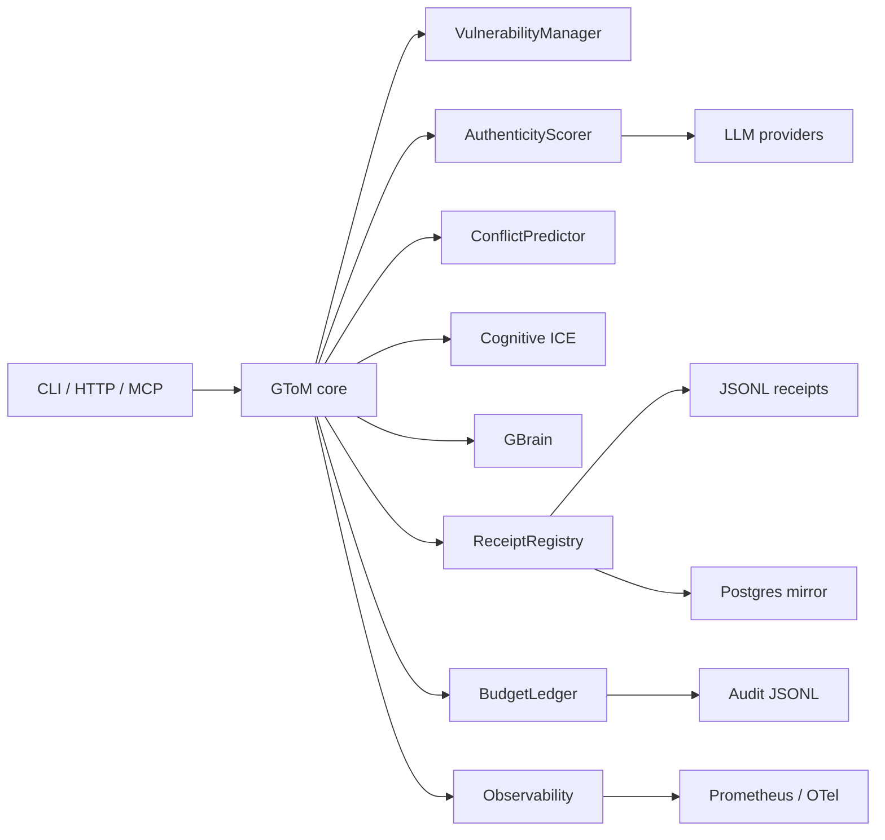

# Data Flow

## Notes

- Public calls are timed and traced.
- Decisions and shell jobs are audit logged.
- Receipts are signed before storage.
- Health checks combine local probes, remote probes, schema, queue, and freshness status.
