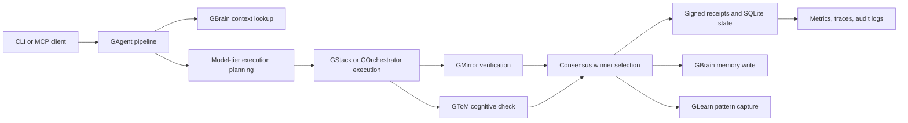

## Quickstart (60 seconds)

```bash
npm install gagent
```

```typescript
import { AgentSDK } from 'gagent';
const agent = new AgentSDK({ apiKey: process.env.ANTHROPIC_API_KEY });
const result = await agent.execute('Write a hello world function in TypeScript');
console.log(result.safe, result.output);
```

> No Docker. No services. Execute tasks safely with built-in PII protection and ethics guardrails.

---

# GAgent

GAgent is the unified CLI, MCP server, and local control plane for the six-tool agent stack:
GBrain, GStack, GOrchestrator, GMirror, GToM, and GLearn. It routes tasks through the
stack, records execution receipts, tracks budget and drift, and exposes the same workflow
to shell users and agent clients.

## What It Does

- Runs tasks through a single command surface with optional parallel execution, verification,
  cognitive checks, and learning capture.
- Provides MCP tools for agents that need to run tasks, inspect health, query receipts,
  inspect drift, read cost data, and manage model tiers.
- Persists run receipts, cost entries, model metrics, budget reservations, and audit logs.
- Exports Prometheus and OpenTelemetry-compatible observability data.
- Bridges stack services while degrading cleanly when one external tool is unavailable.

## Quick Start

```bash
npm install
npm run build
node dist/cli.js health
node dist/cli.js run "implement user authentication" --parallel 3 --verify
```

For local development:

```bash
npm run typecheck
npm test
npm run verify
npm run docs:api
```

## Command Surface

| Command | Purpose |
| --- | --- |
| `gagent init` | Detect and configure the local G-Stack installation. |
| `gagent health` | Check configured tools, internal metrics, and stack health. |
| `gagent run <task>` | Execute a task through the pipeline. |
| `gagent sync` | Reconcile local stack state with incremental, full, and dry-run modes. |
| `gagent config` | Read and update unified configuration. |
| `gagent secrets list`, `secrets rotate` | Inspect secret metadata and rotate local secrets without printing values. |
| `gagent serve` | Start the MCP server. |
| `gagent backup`, `restore`, `export` | Manage persisted state and portable artifacts. |
| `gagent benchmark` | Run tracked local latency and memory benchmarks. |
| `gagent eval`, `replay`, `receipts`, `diff` | Record, replay, and inspect execution evidence. |
| `gagent registry`, `models`, `tier`, `cost` | Inspect tools, model tiers, and budget state. |
| `gagent trend`, `regress`, `drift`, `metrics` | Analyze quality, regressions, drift, and observability. |

The passthrough commands `brain`, `stack`, `orc`, `mirror`, `tom`, and `learn` delegate to
the corresponding stack tool. The aliases `run-parallel`, `run-verified`, `run-safe`, and
`run-smart` provide common pipeline presets.

`gagent sync --incremental` writes gstack-compatible stage results, registers enabled tools
as federated GBrain sources with `pathhash8` IDs, and attaches `.gbrain-source` metadata to
each tool path. `gagent sync --full` also removes legacy source IDs from the prior sync
state. `gagent sync --dry-run --json` reports the planned commands without acquiring a lock,
writing source dotfiles, or updating state.

## Pipeline



## MCP Integration

Register the MCP server with an agent client:

```json
{
  "mcpServers": {
    "gagent": {
      "command": "gagent",
      "args": ["serve"]
    }
  }
}
```

Primary MCP tools include `gagent_run`, `gagent_health`, `gagent_brain_search`,
`gagent_stack_review`, `gagent_config_get`, `gagent_config_set`, `gagent_get_receipts`,
`gagent_get_drift`, `gagent_get_cost_stats`, `gagent_models`, `gagent_tier`, and
`gagent_registry`.

## Configuration

GAgent reads local config from `~/.gagent/config.json` unless overridden by environment.
Common environment variables:

| Variable | Purpose |
| --- | --- |
| `GAGENT_DB_PATH` | Override the SQLite database path. |
| `GAGENT_SYNC_ROOT` | Override the `gstack-gbrain-sync` lock and state directory. |
| `GAGENT_SECRET_DIR` | Override the file-backed secret manager directory. |
| `GAGENT_PERMISSIONS_FILE` | JSON token-hash permission grant file for MCP callers. |
| `GAGENT_AUDIT_DIR` | Override JSONL audit output directory. |
| `GAGENT_METRICS_PATH` | Override persisted local metrics path. |
| `GAGENT_RATE_LIMIT_RPM`, `GAGENT_RATE_LIMIT_RPH` | MCP per-token request limits. |
| `GAGENT_HEALTH_RATE_LIMIT_RPM` | Public health endpoint per-client request limit. |
| `GAGENT_HEALTH_SHUTDOWN_TOKEN` | Legacy fallback for the health shutdown secret. |
| `GAGENT_HEALTH_WEBHOOK_URL` | Send health-drop webhooks. |
| `GAGENT_MAX_CONCURRENCY`, `GAGENT_MAX_QUEUE_DEPTH` | Overall pipeline concurrency and backpressure queue limits. |
| `GAGENT_CONTEXT_CACHE_TTL_MS` | TTL for cached GBrain context lookups. |
| `GAGENT_LLM_CALL_RESERVE_USD` | Per-call budget reservation. |
| `GAGENT_BUDGET_RESERVATION_TTL_MS` | Reservation expiration window. |
| `RECEIPT_SIGNATURE_KEY` | HMAC key for signed receipts. |
| `GBRAIN_ENDPOINT`, `GSTACK_ENDPOINT`, `GORCHESTRATOR_ENDPOINT` | Stack service endpoints. |
| `GBRAIN_INTEGRATION_MODE` | `http` or `mcp` GBrain transport for context, status, and receipt integration. |
| `GBRAIN_MCP_ENDPOINT` | Optional MCP endpoint when `GBRAIN_INTEGRATION_MODE=mcp`. |
| `GBRAIN_AUTH_TOKEN` | Bearer token for authenticated GBrain calls. |
| `GBRAIN_TIMEOUT_MS`, `GBRAIN_MAX_RETRIES`, `GBRAIN_BACKOFF_MS` | GBrain timeout and retry controls. |
| `GBRAIN_CIRCUIT_FAILURES`, `GBRAIN_CIRCUIT_COOLDOWN_MS` | GBrain circuit-breaker controls. |
| `GMIRROR_ENDPOINT`, `GTOM_ENDPOINT`, `GLEARN_ENDPOINT` | Stack service endpoints. |

## Standalone Utilities

GAgent exports utilities that can be used independently of the full pipeline:

### PII Redactor

Redact personally identifiable information from text:

```typescript
import { PIIRedactor, defaultDyadRedactor } from 'gagent/PIIRedactor';

const redactor = new PIIRedactor({
  redact_phone_numbers: true,
  redact_names: true,
  redact_locations: true,
  hash_contact_ids: true,
  knownNames: ['Alice', 'Bob'],
});

const redacted = redactor.redactText('Call Alice at 555-1234');
// '[NAME] at [PHONE]'
```

Or use the default Dyad configuration:

```typescript
import { defaultDyadRedactor } from 'gagent/PIIRedactor';
const redactor = defaultDyadRedactor();
```

### Ethical Classifier

Classify messages for ethical refusal before surfacing insights:

```typescript
import { EthicalRefusalClassifier } from 'gagent/EthicalClassifier';

const classifier = new EthicalRefusalClassifier(llmClient);
const result = await classifier.classify({
  message_window: [...], // RedactedMessage[]
  proposed_insight: 'The user should leave their partner.',
  insight_type: 'pattern',
});

if (result.should_refuse) {
  console.log(`Refused: ${result.reason} - ${result.explanation}`);
}
```

The classifier uses both heuristic rules and LLM-based classification to detect:
- Minors in the conversation
- Blame assignment language
- Out-of-scope clinical advice
- Coercive framing
- Insufficient data

## Documentation

| Document | Scope |
| --- | --- |
| [API overview](docs/API.md) | Public CLI, MCP, and TypeScript surfaces. |
| [Generated API docs](docs/api/index.html) | TypeDoc output generated by `npm run docs:api`. |
| [MCP contract](docs/MCP_CONTRACT.md) | Tool schemas, scopes, and compatibility rules. |
| [Evaluation baseline](docs/EVAL_BASELINE.md) | Quality corpus, statistics, and acceptance thresholds. |
| [Runbook](docs/runbook.md) | Operator workflows and routine maintenance. |
| [Troubleshooting](docs/TROUBLESHOOTING.md) | Known failure modes and fixes. |
| [Security model](docs/SECURITY_MODEL.md) | Trust boundaries, secret handling, and audit posture. |
| [Performance](docs/PERFORMANCE.md) | Benchmarks, load tests, SLO/SLI, backpressure, streaming, cancellation, and caching. |
| [Data flow](docs/DATA_FLOW.md) | Mermaid architecture and persistence flow. |
| [Integration guide](docs/INTEGRATION.md) | Embedding GAgent in projects and agent clients. |
| [Migrations](MIGRATIONS.md) | Schema and state migration process. |
| [Operations](OPERATIONS.md) | Deployment and release operations. |
| [Testing](TESTING.md) | Test layers and quality gates. |
| [ADR 0001](docs/adr/0001-unified-agent-control-plane.md) | Control-plane architecture decision. |

## Verification

Before pushing a change, run:

```bash
npm run verify
git diff --check
```

`npm run verify` executes package contract checks, documentation checks, privacy scans,
test-isolation checks, MCP contract checks, TypeScript typechecking, and Jest.

## License

MIT
