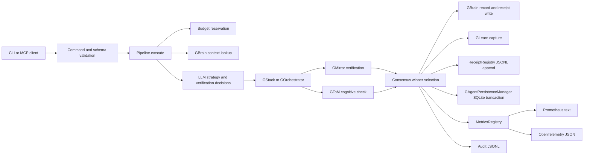

# GAgent Data Flow

## Data Classes

| Data | Source | Destination | Sensitivity |
| --- | --- | --- | --- |
| Task text | CLI/MCP caller | Pipeline, receipts, optional GBrain | Potentially sensitive. |
| Attempt output | Stack tools | Selector, receipts, optional GBrain | Potentially sensitive. |
| Model usage | LLM client | SQLite, metrics, receipts | Operational. |
| Budget reservations | Pipeline | SQLite | Operational. |
| Audit decisions | Pipeline and observability | JSONL audit logs | Operational, may include task metadata. |
| Health data | Stack endpoints | CLI/MCP, metrics | Operational. |

## Persistence Flow

1. A task is validated and budget is reserved.
2. The pipeline gathers context and executes attempts.
3. The selector chooses a winner and computes receipt scores.
4. The receipt is appended to JSONL.
5. SQLite receives run, cost, metrics, and budget updates in transactional writes.
6. Metrics and audit logs are emitted for monitoring.

## Redaction

Logs and audit events should use structured fields and avoid raw prompt bodies unless the event is
explicitly an execution receipt. Redaction must happen before a field is sent to logs, metrics, or
webhooks.
