## Quickstart (60 seconds)

```bash
npm install glearn
```

```typescript
import { LearnSDK } from 'glearn';
const learn = new LearnSDK({ apiKey: process.env.ANTHROPIC_API_KEY });
const result = await learn.demo(); // runs on built-in synthetic data
console.log('Patterns found:', result.patterns?.length ?? 0);
```

> No Docker. No services. Mine patterns from execution history and generate optimization proposals.

---

# GLearn

GLearn is the meta-learning and reflective layer for the G-Stack. It mines patterns from
execution receipts and cross-tool data, generates improvement proposals, evaluates those proposals
counterfactually, and keeps humans or owning tools in control of changes.

GLearn is not an autonomous self-modification engine. It produces evidence-backed proposals and
tracks approval state; applying a proposal is an explicit operator or owning-tool decision.

## What It Does

- Ingests GBrain, GStack, GOrchestrator, GMirror, and GToM signals.
- Mines temporal, semantic, outcome, coverage, and drift patterns.
- Uses multi-tier model consensus for pattern confidence and proposal quality.
- Generates typed proposals for stack tuning and optimization.
- Evaluates proposals against baseline metrics before approval.
- Persists patterns, proposals, receipts, cost data, drift snapshots, and audit logs.
- Exposes CLI and MCP interfaces for agent clients and operators.

## Quick Start

```bash
npm install
npm run build
node dist/cli.js health
node dist/cli.js run --counterfactual
```

Development checks:

```bash
npm run typecheck
npm test
npm run verify
npm run docs:api
```

## Command Surface

| Command | Purpose |
| --- | --- |
| `glearn run` | Run a learning cycle across configured data sources. |
| `glearn patterns` | List mined patterns and optional filters. |
| `glearn proposals` | List generated proposals and lifecycle state. |
| `glearn approve`, `reject` | Move proposals through review state. |
| `glearn health` | Check stack integrations and local health diagnostics. |
| `glearn sync` | Register stack tool sources with GBrain using incremental, full, and dry-run modes. |
| `glearn eval` | Run evaluation corpora and statistical comparisons. |
| `glearn stats`, `drift`, `trend`, `regress` | Inspect learning quality, drift, and regression gates. |
| `glearn replay`, `receipts`, `diff` | Inspect and compare execution evidence. |
| `glearn cost`, `metrics` | Inspect budget ledger and observability exports. |
| `glearn backup`, `restore`, `export` | Manage durable state. |
| `glearn secrets list`, `secrets rotate` | Inspect secret metadata and rotate local secrets without printing values. |

`glearn sync --incremental` emits gstack-compatible stage results, registers each stack
tool as a federated GBrain source with a `pathhash8` ID, and writes a `.gbrain-source`
attachment into each tool path. `glearn sync --full` also removes legacy source IDs from
the prior sync state. `glearn sync --dry-run --json` shows planned commands without
acquiring a lock, writing source dotfiles, or updating state.

## Learning Flow

```mermaid
flowchart LR
  Operator["CLI or MCP client"] --> GLearn["GLearn learning cycle"]
  GLearn --> Ingest["Cross-tool data ingestion"]
  Ingest --> Miner["Pattern miner"]
  Miner --> Consensus["Tiered model consensus"]
  Consensus --> Proposals["Proposal generator"]
  Proposals --> Counterfactual["Counterfactual evaluator"]
  Counterfactual --> Review["Human or owning-tool approval"]
  Review --> Persistence["SQLite, state file, receipts"]
  Persistence --> Metrics["Metrics, traces, audit logs"]
```



## MCP Integration

```json
{
  "mcpServers": {
    "glearn": {
      "command": "glearn",
      "args": ["serve"]
    }
  }
}
```

Primary MCP tools are `glearn_run`, `glearn_patterns`, `glearn_get_patterns`,
`glearn_proposals`, `glearn_get_proposals`, `glearn_approve`, `glearn_health`,
`glearn_get_receipts`, `glearn_get_drift`, and `glearn_get_cost_stats`.

## Configuration

Common environment variables:

| Variable | Purpose |
| --- | --- |
| `GLEARN_DB_PATH` | Override the SQLite database path. |
| `GLEARN_STATE_PATH` | Override JSON state persistence path. |
| `GLEARN_AUDIT_DIR` | Override local audit log directory. |
| `GLEARN_SECRET_DIR` | Override the file-backed secret manager directory. |
| `GLEARN_PERMISSIONS_FILE` | JSON token-hash permission grant file for MCP callers. |
| `GLEARN_METRICS_PATH` | Override persisted LLM metrics path. |
| `GLEARN_RATE_LIMIT_RPM`, `GLEARN_RATE_LIMIT_RPH` | MCP per-token request limits. |
| `GLEARN_HEALTH_RATE_LIMIT_RPM` | Public health endpoint per-client request limit. |
| `GLEARN_HEALTH_SHUTDOWN_TOKEN` | Legacy fallback for the health shutdown secret. |
| `GLEARN_HEALTH_WEBHOOK_URL` | Send health-drop webhook notifications. |
| `GLEARN_LLM_CALL_RESERVE_USD` | Per-call budget reservation. |
| `GLEARN_BUDGET_RESERVATION_TTL_MS` | Budget reservation expiration. |
| `GLEARN_SYNC_ROOT` | Override the `gstack-gbrain-sync` lock and state directory. |
| `GLEARN_TOOL_<NAME>_PATH` | Override a source path for `gbrain`, `gstack`, `gorchestrator`, `gmirror`, `gtom`, or `glearn`. |
| `GBRAIN_ENDPOINT`, `GSTACK_ENDPOINT`, `GORCHESTRATOR_ENDPOINT` | Stack service endpoints. |
| `GBRAIN_INTEGRATION_MODE` | `http` or `mcp` GBrain transport for observation and receipt integration. |
| `GBRAIN_MCP_ENDPOINT` | Optional MCP endpoint when `GBRAIN_INTEGRATION_MODE=mcp`. |
| `GBRAIN_AUTH_TOKEN` | Bearer token for authenticated GBrain calls. |
| `GBRAIN_TIMEOUT_MS`, `GBRAIN_MAX_RETRIES`, `GBRAIN_BACKOFF_MS` | GBrain timeout and retry controls. |
| `GBRAIN_CIRCUIT_FAILURES`, `GBRAIN_CIRCUIT_COOLDOWN_MS` | GBrain circuit-breaker controls. |
| `GMIRROR_ENDPOINT`, `GTOM_ENDPOINT` | Stack service endpoints. |

## Documentation

| Document | Scope |
| --- | --- |
| [API overview](docs/API.md) | CLI, MCP, and TypeScript surfaces. |
| [Generated API docs](docs/api/index.html) | TypeDoc output from `npm run docs:api`. |
| [MCP contract](docs/MCP_CONTRACT.md) | Tool schemas, scopes, and compatibility. |
| [Evaluation baseline](docs/EVAL_BASELINE.md) | Corpus structure and quality thresholds. |
| [Runbook](docs/runbook.md) | Routine operations and incident response. |
| [Troubleshooting](docs/TROUBLESHOOTING.md) | Known failure modes and fixes. |
| [Security model](docs/SECURITY_MODEL.md) | Trust boundaries, secrets, and audit posture. |
| [Data flow](docs/DATA_FLOW.md) | Mermaid data-flow diagram and persistence map. |
| [Integration guide](docs/INTEGRATION.md) | Embedding GLearn in projects and agent clients. |
| [Migrations](MIGRATIONS.md) | SQLite and state migration process. |
| [Operations](OPERATIONS.md) | Deployment and release operations. |
| [Testing](TESTING.md) | Test layers and quality gates. |
| [ADR 0001](docs/adr/0001-human-approved-learning-loop.md) | Human-approved learning-loop decision. |

## Verification

Before pushing a change:

```bash
npm run verify
git diff --check
```

`npm run verify` runs package, docs, privacy, test-isolation, MCP contract, typecheck, and Jest
checks.

## License

MIT
