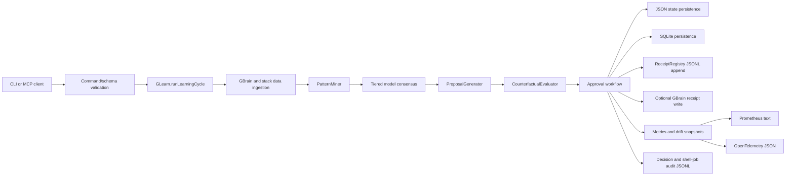

# GLearn Data Flow

## Data Classes

| Data | Source | Destination | Sensitivity |
| --- | --- | --- | --- |
| Receipts | G-Stack tools and GLearn cycles | JSONL, SQLite, optional GBrain | Potentially sensitive. |
| Patterns | Pattern miner | SQLite, state file, proposals | Operational evidence. |
| Proposals | Proposal generator | SQLite, state file, MCP/CLI output | Operational, may reveal weaknesses. |
| Model spend | LLM client | SQLite, budget ledger, metrics | Operational. |
| Drift snapshots | Learning run metrics | In-memory detector, receipts | Operational. |
| Audit events | GLearn decisions | JSONL audit logs | Operational, possibly sensitive. |

## Persistence Flow

1. A learning cycle validates request options and reserves budget for model work.
2. Data is ingested from configured sources.
3. Patterns are mined and scored.
4. Proposals are generated and optionally evaluated counterfactually.
5. State is written to SQLite and the shared persistence state file.
6. A receipt is appended and optionally written to GBrain.
7. Metrics, traces, drift snapshots, and audit logs are emitted.
