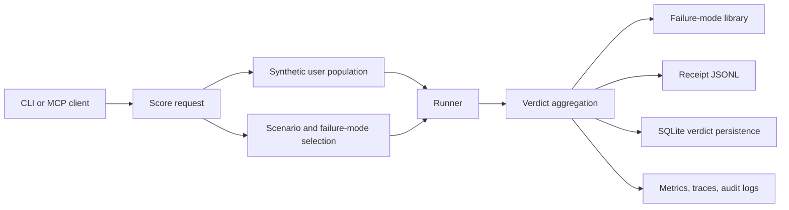

## Quickstart (60 seconds)

```bash
npm install gmirror
```

```typescript
import { MirrorSDK } from 'gmirror';
const mirror = new MirrorSDK({ apiKey: process.env.ANTHROPIC_API_KEY });
const verdict = await mirror.score({ task: 'write tests', output: 'describe(...){}' });
console.log(verdict.overall); // 'pass' or 'fail'
```

> No Docker. No services. Score any LLM output against a synthetic user panel.

---

# GMirror

GMirror is the synthetic-user verification layer for the G-Stack. It scores changes with cognitive
user populations, records verdicts, detects failure modes, calibrates scoring thresholds, and keeps
regression evidence available for release gates.

## What It Does

- Scores diffs, prompts, flows, and implementation outputs against synthetic user panels.
- Aggregates correctness, user outcome, risk, cost, and failure-mode dimensions into verdicts.
- Maintains a failure-mode library and cluster view.
- Calibrates scoring thresholds and model tiers.
- Persists verdicts, receipts, cost entries, trend/drift data, and audit logs.
- Exposes CLI and MCP surfaces for agents and operators.

## Quick Start

```bash
npm install
npm run build
node dist/cli.js health
node dist/cli.js score --diff ./change.patch --panel-size 10
```

Development checks:

```bash
npm run typecheck
npm test
npm run verify
npm run docs:api
```

## Command Surface

| Command | Purpose |
| --- | --- |
| `gmirror score` | Score a change with a synthetic user panel. |
| `gmirror calibrate` | Calibrate thresholds and scoring settings. |
| `gmirror health` | Check local and stack health. |
| `gmirror sync` | Register stack tool sources with GBrain using incremental, full, and dry-run modes. |
| `gmirror replay` | Replay a previous scoring run. |
| `gmirror failure-modes`, `clusters` | Inspect failure-mode library and clusters. |
| `gmirror secrets` | Rotate and list local secrets without printing secret values. |
| `gmirror eval` | Run evaluation corpora. |
| `gmirror receipts`, `diff` | Inspect and compare receipts. |
| `gmirror stats`, `trend`, `drift`, `regress` | Analyze verdict history and quality drift. |
| `gmirror cost`, `sandbox-stats`, `metrics` | Inspect spend, sandbox usage, and observability. |
| `gmirror backup`, `restore`, `export` | Manage durable state. |

`gmirror sync --incremental` emits gstack-compatible stage results, registers each stack
tool as a federated GBrain source with a `pathhash8` ID, and writes a `.gbrain-source`
attachment into each tool path. `gmirror sync --full` also removes legacy source IDs from
the prior sync state. `gmirror sync --dry-run --json` shows planned commands without
acquiring a lock, writing source dotfiles, or updating state.

## Verdict Flow



## MCP Integration

```json
{
  "mcpServers": {
    "gmirror": {
      "command": "gmirror",
      "args": ["serve"]
    }
  }
}
```

Primary MCP tools are `gmirror_score`, `gmirror_health`, `gmirror_failure_modes`,
`gmirror_get_failure_modes`, `gmirror_calibrate`, `gmirror_get_receipts`,
`gmirror_get_trend`, `gmirror_get_drift`, and `gmirror_get_cost_stats`.

## Configuration

Common environment variables:

| Variable | Purpose |
| --- | --- |
| `GMIRROR_DB_PATH` | Override SQLite verdict database path. |
| `GMIRROR_AUDIT_DIR` | Override audit JSONL directory. |
| `GMIRROR_METRICS_PATH` | Override persisted LLM metrics path. |
| `GMIRROR_HEALTH_WEBHOOK_URL` | Send health-drop webhook notifications. |
| `GMIRROR_LLM_CALL_RESERVE_USD` | Per-call budget reservation. |
| `GMIRROR_BUDGET_RESERVATION_TTL_MS` | Budget reservation expiration. |
| `GMIRROR_SYNC_ROOT` | Override the `gstack-gbrain-sync` lock and state directory. |
| `GMIRROR_SECRET_DIR` | Override the local file-backed secret manager directory. |
| `GMIRROR_PERMISSIONS_FILE` | JSON file of SHA-256 token hashes mapped to allowed scopes. |
| `GMIRROR_RATE_LIMIT_RPM` | Per-token MCP calls per minute. |
| `GMIRROR_RATE_LIMIT_RPH` | Per-token MCP calls per hour. |
| `GMIRROR_HEALTH_RATE_LIMIT_RPM` | Per-client health endpoint calls per minute. |
| `GMIRROR_HEALTH_SHUTDOWN_TOKEN` | Legacy fallback for the `health_shutdown_token` secret. |
| `GMIRROR_TOOL_<NAME>_PATH` | Override a source path for `gbrain`, `gstack`, `gorchestrator`, `gmirror`, `gtom`, or `glearn`. |
| `GBRAIN_ENDPOINT` | GBrain endpoint for receipt storage and retrieval. |
| `GBRAIN_INTEGRATION_MODE` | `http` or `mcp` transport for GBrain context, scenario corpus, replay, and QC writes. |
| `GBRAIN_MCP_ENDPOINT` | GBrain MCP endpoint when MCP mode is enabled. |
| `GBRAIN_AUTH_TOKEN` | Legacy fallback for the `gbrain_auth_token` secret. |
| `GBRAIN_TIMEOUT_MS` | Per-call timeout for GBrain calls. |
| `GBRAIN_MAX_RETRIES` | Retry count for transient GBrain failures. |
| `GBRAIN_BACKOFF_MS` | Initial retry backoff for GBrain calls. |
| `GBRAIN_CIRCUIT_FAILURES` | Consecutive transient failures before opening the GBrain circuit. |
| `GBRAIN_CIRCUIT_COOLDOWN_MS` | GBrain circuit breaker cooldown. |
| `DEFAULT_PANEL_SIZE` | Default synthetic user panel size. |
| `ADVERSARIAL_RATIO` | Default adversarial scenario ratio. |

## Documentation

| Document | Scope |
| --- | --- |
| [API overview](docs/API.md) | CLI, MCP, and TypeScript surfaces. |
| [Generated API docs](docs/api/index.html) | TypeDoc output generated by `npm run docs:api`. |
| [MCP contract](docs/MCP_CONTRACT.md) | Tool schemas, scopes, and compatibility rules. |
| [Evaluation baseline](docs/EVAL_BASELINE.md) | Verdict corpus and acceptance thresholds. |
| [Runbook](docs/runbook.md) | Operator workflows and incident response. |
| [Troubleshooting](docs/TROUBLESHOOTING.md) | Known failure modes and fixes. |
| [Security model](docs/SECURITY_MODEL.md) | Trust boundaries, secrets, and audit posture. |
| [Data flow](docs/DATA_FLOW.md) | Mermaid data-flow diagram and persistence map. |
| [Integration guide](docs/INTEGRATION.md) | Embedding GMirror in projects and agent clients. |
| [Migrations](MIGRATIONS.md) | SQLite migration process. |
| [Operations](OPERATIONS.md) | Deployment and release operations. |
| [Testing](TESTING.md) | Test layers and quality gates. |
| [ADR 0001](docs/adr/0001-verdicts-as-release-evidence.md) | Verdict evidence architecture decision. |

## Verification

```bash
npm run verify
git diff --check
```

## License

MIT
