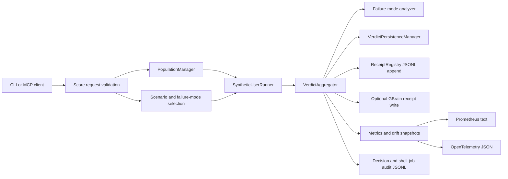

# GMirror Data Flow

## Data Classes

| Data | Source | Destination | Sensitivity |
| --- | --- | --- | --- |
| Diff/change payload | CLI/MCP caller | Runner, verdict, receipt metadata | Potentially sensitive. |
| Synthetic user results | Runner | Verdict, failure analyzer | Operational evidence. |
| Verdicts | Aggregator | SQLite, receipts, MCP/CLI output | Release evidence. |
| Failure modes | Analyzer | Library, clusters, receipts | Product-risk evidence. |
| Cost data | LLM client | Budget ledger, metrics | Operational. |
| Audit events | GMirror decisions | JSONL audit logs | Operational, possibly sensitive. |
