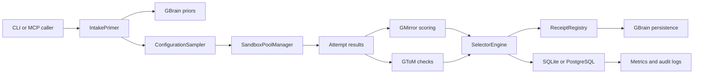

# Data Flow

## Sensitive Data

Task text, attempt output, and scoring evidence may contain sensitive data. Logs and audit entries pass through PII redaction before writing. Receipts should contain evidence summaries rather than raw secrets.

## Persistence Paths

- SQLite: `~/.gorchestrator/gorchestrator.db`
- Audit: `~/.gorchestrator/audit/*.jsonl`
- Receipts: weekly JSONL receipt files
- PostgreSQL: `GORCHESTRATOR_DATABASE_URL`
